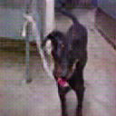

# ML-Applied-AI-Midterm

## Train a binary classifier (called A) on the dataset using transfer learning (exactly like Assignment 1). The images should be downscaled to 128x128
The above requirement is done in the Model A notebook

## Next, train the SRGAN to generate 128x128 images. Each image of the training is downscaled to 32x32.
The above requirements is done in the SRGAN notebook. Example image from EPOCH 150 (pretraining 50 epochs, training srgan for 100 epochs)

## Show some examples of scaled images in JNB
The above requirement is done in the SRGAN notebook, and saved to the outputs folder


## Apply normalization and image transformation, and demonstrate some of the transformed samples
This is done in the Model B notebook

## Utilize the images generated by SRGAN in order to train a new model (called B)
The above requirement is done in the Model B notebook, images were generated into a ./Data/srgan/ directory from the Generating 128x128 Images notebook.

## Compare the performance of both models using different metrics such as F1, Accuracy, AUC
This is done in the Comparison notebook.

# How to use 
Download the repo with the following command. git clone https://github.com/DavidN0809/Applied-AI-Midterm.git
## Create Conda Env
```bash
conda env create -f environment.yml -n applied-ai then run conda activate applied-ai
```

## Step 1
Run the Model A notebook, it will save the figures into the ./figs directory.

## Step 2
Run the SRGAN notebook to train and save the generator and discriminator models.


## Step 3
Run the Generating 128x128 Images notebook to generate the images for model B.

## Step 4
Run model B notebook it will save the figures into the ./figs directory.

## Step 5
Run the Comparison notebook to see all plots from both model A and Model B


# Directory Explained
Inside ./Data is the dogs vs cats dataset (Not uploaded to git). Inside ./figs is the accuracy, AUC and f1 accuracy plots. Inside ./models is the best model_a, model_b, generator and discriminator models. Inside ./notebooks/srgan-output/ is where the output image files from the SRGAN notebook is stored, comparing the low res, high res and generated images. Inside ./Data/srgan (not uploaded to git) is a copy of ./Data that is resized to 128x128 using the SRGAN, this is created in the generated images notebook.


## Needed Commands to train and generate images (on headless machine)
### Using tmux and papermill to process srgan and model-a

### Using tmux and papermill to train srgan
```bash
conda activate applied-ai
tmux new -s papermill_session-srgan
conda activate applied-ai
papermill /opt/notebooks/Applied-AI-Midterm/notebooks/srgan.ipynb /opt/notebooks/Applied-AI-Midterm/notebooks/output/srgan-output.ipynb
```


### Using tmux and papermill to generate images
```bash
conda activate applied-ai
tmux new -s papermill_session-generate
conda activate applied-ai
papermill /opt/notebooks/Applied-AI-Midterm/notebooks/generating-srgan-images.ipynb /opt/notebooks/Applied-AI-Midterm/notebooks/output/generating-srgan-images-output.ipynb
```

### Using tmux and papermill to train a
```bash
conda activate applied-ai
tmux new -s papermill_session-model-a
conda activate applied-ai
papermill /opt/notebooks/Applied-AI-Midterm/notebooks/model-a.ipynb /opt/notebooks/Applied-AI-Midterm/notebooks/output/model-a-output.ipynb
```

### Using tmux and papermill to train b
```bash
conda activate applied-ai
tmux new -s papermill_session-model-b
conda activate applied-ai
papermill /opt/notebooks/Applied-AI-Midterm/notebooks/model-b.ipynb /opt/notebooks/Applied-AI-Midterm/notebooks/output/model-b-output.ipynb
```


### Attach back later
```bash
tmux attach -t papermill_session-model-a
exit
```

### force kill
```bash
tmux kill-session -t papermill_session-model-a
```

## force kill all
```bash
tmux kill-server
```
